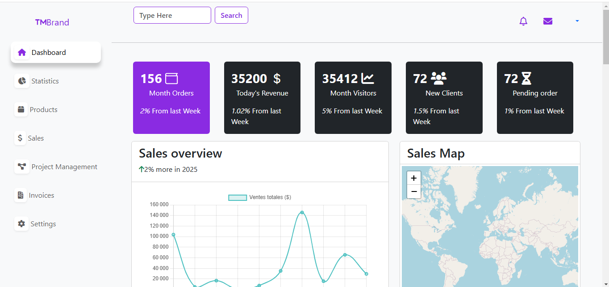

# React Dashboard

## Description
React Dashboard is a modern and interactive project designed to provide an intuitive and dynamic user interface. This dashboard can be used for administrative, management, or tracking applications, offering reusable components and a clear structure.

## Screenshots

  
 
 
 
 

## Features
- **Sales Map**: Visualize sales data geographically.
- **Statistics**: Real-time and dynamic charts to track key metrics.
- **Calendar**: Integrated calendar for scheduling and event management.
- **Modern UI**: Designed with React components.
- **Responsive Design**: Compatible with all devices (desktop, tablet, mobile).
- **Easy Customization**: Modular structure for easy updates and additions.

## Technologies Used
- **React**: For building the user interface.
- **JSON Server**: Custom backend server to simulate APIs for dynamic data.
- **Bootstrap**: For responsive and modern styling.
- **Font Awesome**: For icons and visual enhancements.
- **APIs**: Worked with multiple APIs to fetch and display dynamic data.

## Prerequisites
Before you begin, make sure you have the following tools installed on your machine:

- [Node.js](https://nodejs.org/) (version 16 or higher)
- [npm](https://www.npmjs.com/) or [yarn](https://yarnpkg.com/)
- A text editor like [VS Code](https://code.visualstudio.com/)

## Installation
1. Clone the project repository:
   ```bash
   git clone https://github.com/laroche237/react-dashboard.git
   ```

2. Navigate to the project folder:
   ```bash
   cd react-dashboard
   ```

3. Install dependencies:
   ```bash
   npm install
   ```

## Getting Started
To start the project in development mode, use:
```bash
npm start
```
Then open your browser and go to:
```
http://localhost:3000
```

## Available Scripts
- **`npm start`**: Runs the app in development mode.
- **`npm build`**: Builds the app for production.
- **`npm test`**: Runs unit tests (if configured).


## Contribution
Contributions are welcome! If you want to contribute:
1. Fork this repository.
2. Create a branch for your feature:
   ```bash
   git checkout -b feature/my-feature
   ```
3. Make your changes and commit them:
   ```bash
   git commit -m "Add my feature"
   ```
4. Push to your branch:
   ```bash
   git push origin feature/my-feature
   ```
5. Open a pull request.

Thank you for using React Dashboard! If you have any questions or suggestions, feel free to reach out. 😊